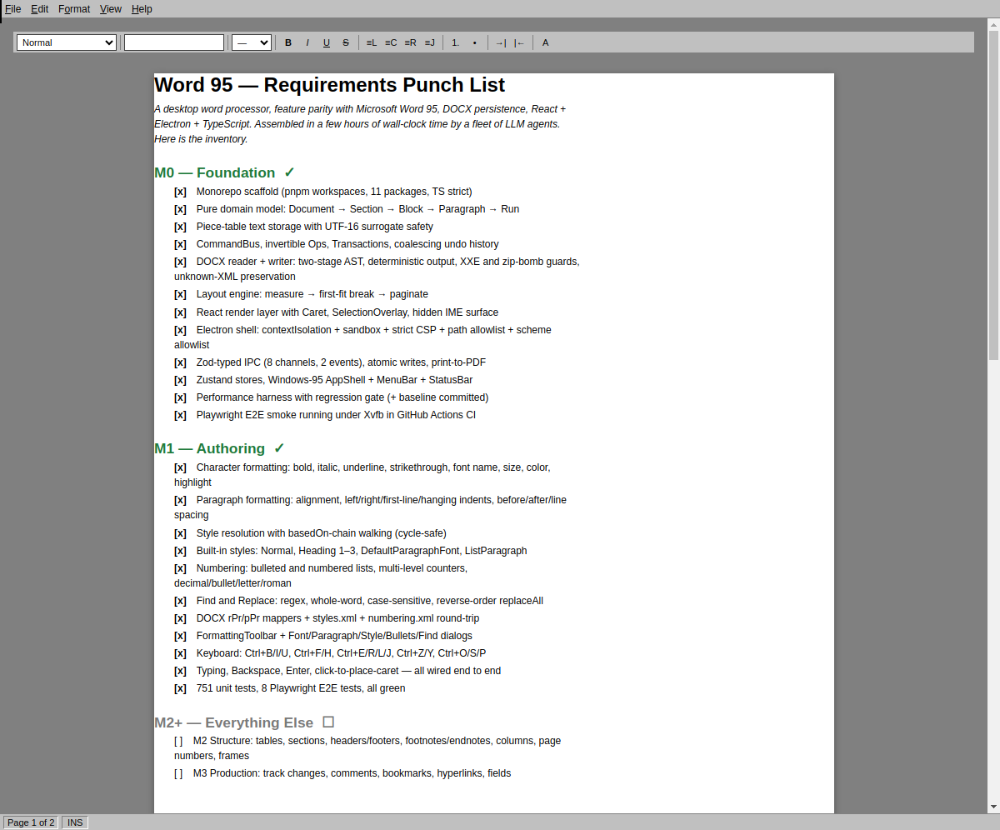

# Word

A desktop word processor with **feature-parity to Microsoft Word 95**. DOCX in, DOCX out. React + Electron + TypeScript, built as a reference implementation of clean software architecture.



Assembled in a few hours of wall-clock time by a fleet of LLM agents. See `docs/architecture/overview.md` for the architecture and `docs/requirements/features.md` for the Word 95 feature inventory. The document the app opens to is the live punch list.

## Status

- **M0 — Foundation ✓** — domain, engine, DOCX round-trip, layout, render, shell, IPC
- **M1 — Authoring ✓** — character & paragraph formatting, styles, lists, find & replace, typing
- **M2+ — TODO** — tables, sections, headers/footers, images, macros, clipboard

Gates: **751 unit tests**, **8 Electron E2E tests**, TypeScript strict, ESLint + Prettier clean, regression-gated perf harness.

## Quick start

Requires Node ≥ 20 and pnpm ≥ 9 (enable via `corepack enable pnpm`).

```bash
pnpm install                          # install workspace deps
pnpm build                            # compile everything
pnpm --filter @word/app dev:electron  # launch the app from source
```

Common tasks:

```bash
pnpm typecheck          # tsc --noEmit across all packages
pnpm lint               # eslint + prettier --check
pnpm test               # vitest unit + property tests
pnpm --filter @word/app e2e     # Playwright Electron smoke (needs xvfb-run on Linux)
pnpm perf               # performance scenarios + baseline comparison
```

## Distribution

Installers for macOS, Windows, and Linux are produced by [electron-builder](https://www.electron.build/).

### Build locally for the current OS

```bash
pnpm build
pnpm dist                # produces native artifacts for the current OS
```

Artifacts land in `packages/app/release/`.

### Target a specific platform

```bash
pnpm dist:mac            # Word-*-mac-x64.dmg, Word-*-mac-arm64.dmg, *.zip
pnpm dist:win            # Word-*-win-x64.exe (NSIS + portable)
pnpm dist:linux          # Word-*-linux-x86_64.AppImage, Word-*-linux-amd64.deb
```

**Cross-building caveats:**

- **macOS** builds must run on a Mac for signing + notarisation. Unsigned `.dmg`s can be produced elsewhere but Gatekeeper will block them on end-user Macs.
- **Windows** signed `.exe`s must be produced on Windows; NSIS can cross-build unsigned via Wine.
- **Linux** builds work from any host.

### Cross-platform CI (all three OSes in one go)

Push a version tag — `git tag v0.1.0 && git push --tags` — and `.github/workflows/release.yml` runs a three-runner matrix (`ubuntu-22.04`, `macos-14`, `windows-2022`), uploads each platform's artifacts, and opens a draft GitHub Release.

`workflow_dispatch` also works from the Actions tab without tagging.

### Code signing (optional)

Set these repository secrets to enable signing + notarisation in CI:

- macOS: `CSC_LINK`, `CSC_KEY_PASSWORD`, `APPLE_ID`, `APPLE_APP_SPECIFIC_PASSWORD`, `APPLE_TEAM_ID`
- Windows: `CSC_LINK`, `CSC_KEY_PASSWORD`

See `docs/packaging.md` for the full rundown.

## Installing the built artifacts

- **macOS** — `open Word-*.dmg`, drag `Word.app` to `/Applications`.
- **Windows** — double-click the `.exe` installer or run the portable binary directly.
- **Linux**:
  - AppImage — `chmod +x Word-*.AppImage && ./Word-*.AppImage`
  - Debian/Ubuntu — `sudo apt install ./Word-*.deb`

## Repo layout

```
packages/
  domain/         pure document model (no I/O, no UI, no framework)
  engine/         CommandBus, Ops, Transactions, Selection, History
  docx/           ECMA-376 reader/writer (two-stage AST ↔ domain)
  layout/         measure / shape / break / paginate / position
  render/         React bindings for layout + selection overlay
  ui/             menus, toolbars, dialogs, stores, keyboard dispatcher
  shell/          Electron main + sandboxed preload
  ipc-schema/     shared Zod IPC schemas
  app/            composition root (Electron entry, installers)
  dev-harness/    perf harness with regression gate
  test-fixtures/  DOCX corpus + golden files
tooling/          shared config (eslint, tsconfig)
docs/
  requirements/   features, DOCX format, UX, non-functional budgets
  architecture/   overview, editor-core, rendering, persistence, electron, UI
  adr/            Architecture Decision Records (20 accepted)
  packaging.md    distribution details
  screenshots/    demo imagery
```

## Documentation

Start here:

1. [`docs/architecture/overview.md`](docs/architecture/overview.md) — the canonical architecture
2. [`docs/requirements/features.md`](docs/requirements/features.md) — definitive Word 95 behavior inventory
3. [`docs/adr/`](docs/adr) — 20 accepted Architecture Decision Records
4. [`CLAUDE.md`](CLAUDE.md) — rules for engineers (human or AI) touching this repo

## Why this exists

The interesting pedagogical question is no longer whether an LLM can reimplement a 30-year-old word processor — it manifestly can. The question is what students should learn now that this is true.

Re-read the welcome document the app opens to. That's the point.
